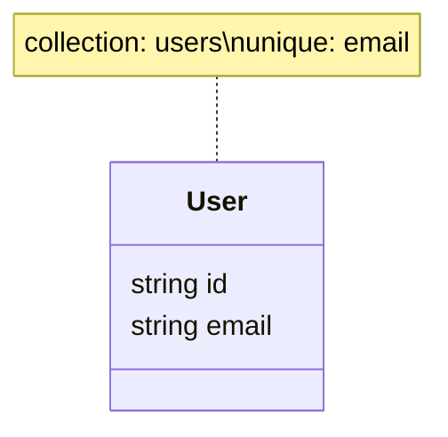

# MongoDB Schema

Use this guide when a backend feature stores or changes persistent data.

This starter guide contains common schema rules only. If project-specific schema rules exist, follow them in addition to this guide.

## Start Here

- Define the schema before route implementation.
- Define the data model before API response details when the feature persists data.
- Keep schema, indexes, and data invariants close to the model definition.
- Do not add persistence for behavior that can remain stateless.
- Discuss MongoDB indexes with the user before adding them.
- After designing or changing schemas, update the schema UML when one exists.

## Model Location

Use one folder per domain:

```txt
apps/api/src/models/<domain>/
  model.ts
  mongo.ts
```

Use:

- `model.ts` for domain types, constants, and helpers. It must not import `mongoose`.
- `mongo.ts` for Mongo/Mongoose schema and model. It may import `mongoose`.

Create the domain model folder when the first model for that domain is added.

## Schema Design

Define:

- collection name
- schema fields and TypeScript shape
- required and optional fields
- timestamps
- lifecycle fields such as status, soft delete, archived state, or deletion timestamp
- validation rules
- default values
- indexes and uniqueness constraints

Use clear field names that match backend domain language.

## MongoDB Indexes

Do not add indexes automatically.

Before adding indexes, tell the user:

- which indexes you recommend
- which query or constraint each index supports
- whether the index is unique
- why the index is worth maintaining

Add indexes only after the user agrees.

Consider indexes for fields used in:

- common filters
- lookups by ID or external identifier
- sorting
- uniqueness constraints
- status or lifecycle queries

Prefer compound indexes for common multi-field queries.

Use unique indexes for data invariants that must be enforced by the database.

Do not add indexes for fields that are not queried or used for constraints.

Keep index definitions near the schema/model definition.

## Schema UML

Maintain a schema UML when persistent models exist.

Use:

```txt
docs/schema/mongo.md
```

Create the file when the first persistent model is added.

Use Mermaid `classDiagram` unless the project already uses another diagram format.

Include:

- model names
- important fields and types
- required relationships between models, directly in the diagram
- uniqueness constraints or indexes that affect behavior, directly in the diagram

Use diagram notes for collection and index metadata:



Keep the diagram focused on persistent data structure.

Do not put feature-specific planning notes in `docs/schema/mongo.md`, such as future fields that may be added later. Keep those notes close to the relevant model or feature document instead.

Do not create separate index-summary sections when the same information can live in the diagram. Keeping index notes beside the model reduces drift as more schemas are added.

## API Boundary

- Do not expose raw database documents directly when the API shape should be stable.
- Convert documents to API DTOs when fields need renaming, hiding, formatting, or computed values.
- Do not expose internal fields such as version keys, deleted markers, or sensitive values unless they are part of the public contract.
- Keep Mongo document types separate from domain/API-facing types.

## Tests

When schema behavior affects the feature, test the behavior through API or service tests.

Test important behavior such as:

- required field validation
- uniqueness constraints
- status or lifecycle transitions
- soft delete behavior
- query behavior that depends on indexes or common filters
