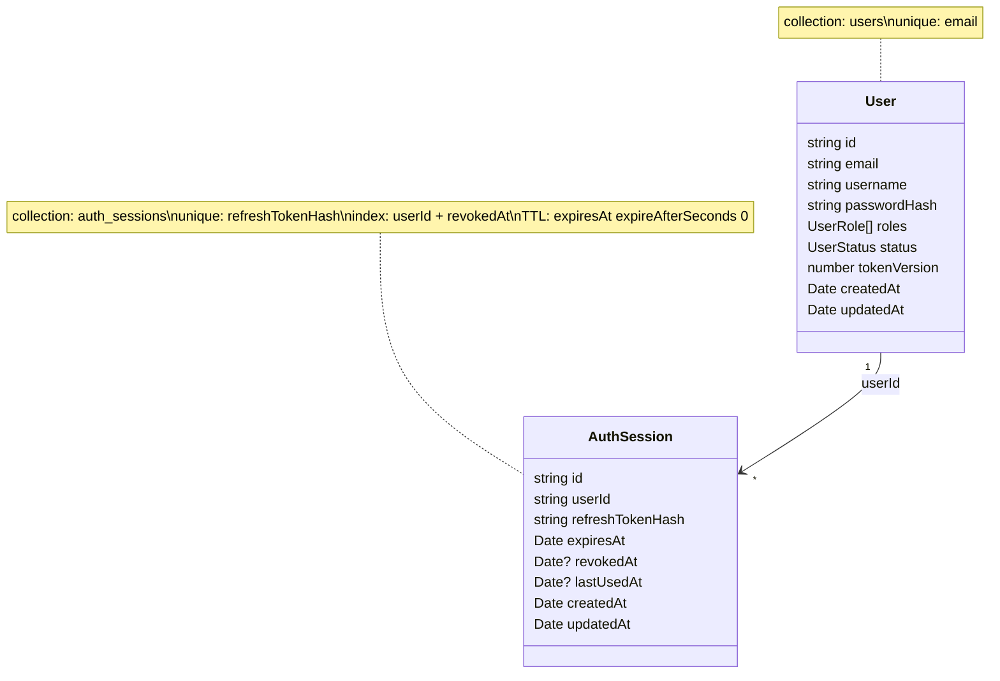

# Mongo Schema

Persistent Mongo model overview.

```mermaid
classDiagram
  class User {
    string id
    string email
    string username
    string passwordHash
    UserRole[] roles
    UserStatus status
    number tokenVersion
    Date createdAt
    Date updatedAt
  }

  class AuthSession {
    string id
    string userId
    string refreshTokenHash
    Date expiresAt
    Date? revokedAt
    Date? lastUsedAt
    Date createdAt
    Date updatedAt
  }

  User "1" --> "*" AuthSession : userId

  note for User "collection: users\nunique: email"
  note for AuthSession "collection: auth_sessions\nunique: refreshTokenHash\nindex: userId + revokedAt\nTTL: expiresAt expireAfterSeconds 0"
```
